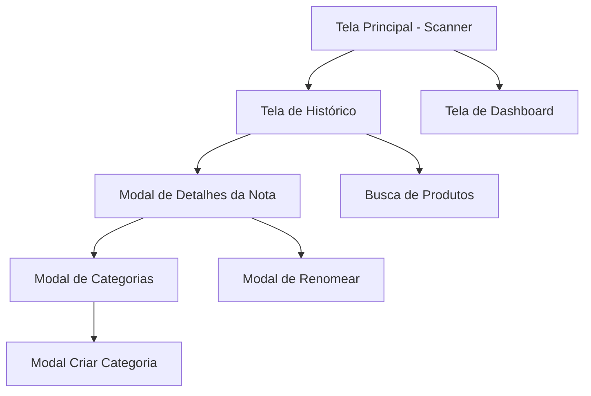

# 📱 NFC-e Scanner - Documentação UI/UX

## Visão Geral

**NFC-e Scanner** é um aplicativo móvel para gestão de despesas pessoais através da leitura de notas fiscais eletrônicas (NFC-e). O app escaneia QR Codes de cupons fiscais, extrai automaticamente os itens e valores, e permite categorização e análise de gastos.

---

## Arquitetura de Telas

---

## 📸 Tela 1: Scanner de QR Code (Principal)

### Descrição
Tela inicial do app. Exibe a câmera para escaneamento de QR Codes de NFC-e.

### Elementos de Interface

| Elemento | Tipo | Posição | Função |
|----------|------|---------|--------|
| **Câmera** | CameraView | Centro (fullscreen) | Captura QR Codes em tempo real |
| **Moldura de foco** | View com bordas | Centro | Guia visual para apontar QR Code |
| **Botão Flash** | TouchableOpacity | Topo esquerdo | Liga/desliga flash ⚡ |
| **Botão Câmera** | TouchableOpacity | Topo direito | Troca câmera frontal/traseira 🔄 |
| **Indicador de Scan** | View circular | Centro inferior | Mostra quando está escaneando |
| **Botão Histórico** | TouchableOpacity | Rodapé esquerdo | Navega para histórico 📋 |
| **Botão Dashboard** | TouchableOpacity | Rodapé direito | Navega para relatórios 📊 |
| **Instrução** | Text | Abaixo da moldura | "Aponte para o QR Code da nota" |

### Estados

| Estado | Visual | Comportamento |
|--------|--------|---------------|
| **Idle** | Câmera ativa | Aguardando QR Code |
| **Processando** | Overlay com loading | "Lendo nota fiscal..." |
| **Sucesso** | Modal com resultado | Exibe dados da nota |
| **Erro** | Modal vermelho | Mensagem de erro humanizada |

### Fluxo de Interação
1. Usuário aponta câmera para QR Code
2. App detecta automaticamente e vibra
3. Overlay de loading aparece
4. Dados são enviados ao servidor
5. Modal com resultado abre

### Melhorias UX Sugeridas
- [ ] Animação de pulsação na moldura de foco
- [ ] Som de confirmação ao escanear
- [ ] Histórico de últimos 3 scans rápidos na tela inicial
- [ ] Onboarding para primeiro uso

---

## 📋 Tela 2: Histórico de Notas

### Descrição
Lista todas as notas fiscais escaneadas com busca e filtros.

### Elementos de Interface

| Elemento | Tipo | Posição | Função |
|----------|------|---------|--------|
| **Header** | View | Topo | "← Voltar" + "Histórico" |
| **Barra de Busca** | TextInput | Abaixo header | Busca por mercado ou produto |
| **Chips de Filtro** | ScrollView horizontal | Abaixo busca | Todos, 7 Dias, 30 Dias, Este Mês |
| **Info de Resultados** | Text | Abaixo filtros | "X resultado(s)" |
| **Lista de Notas** | FlatList | Centro | Cards de notas fiscais |
| **Card de Nota** | TouchableOpacity | Item da lista | Mercado, data, total, qtd itens |

### Modos de Exibição

1. **Modo Lista de Notas** (padrão)
   - Exibe cards de notas agrupadas por estabelecimento
   - Ordenadas por data (mais recente primeiro)

2. **Modo Busca de Produtos**
   - Ativado ao buscar por nome de produto
   - Exibe lista de produtos com preços em diferentes mercados
   - Permite comparação de preços

### Card de Nota

| Campo | Formato | Exemplo |
|-------|---------|---------|
| **Ícone** | Emoji | 🛒 |
| **Estabelecimento** | String | "ASUN COMERCIO..." |
| **Data** | DD/MM/YYYY | "22/12/2025" |
| **Total** | R$ X,XX | "R$ 154,39" |
| **Qtd Itens** | X itens | "18 itens" |

### Card de Produto (modo busca)

| Campo | Formato | Exemplo |
|-------|---------|---------|
| **Nome** | String | "ARROZ KIGOSTOSO 1kg" |
| **Mercado** | String | "ASUN COMERCIO" |
| **Preço** | R$ X,XX | "R$ 3,59" |
| **Data** | DD/MM | "22/12" |

### Filtros Disponíveis

| Filtro | Descrição |
|--------|-----------|
| Todos | Sem filtro de data |
| 7 Dias | Últimos 7 dias |
| 30 Dias | Últimos 30 dias |
| Este Mês | Mês atual |

### Pull-to-Refresh
- Suportado na FlatList
- Atualiza lista do servidor

### Melhorias UX Sugeridas
- [ ] Skeleton loading ao carregar
- [ ] Agrupamento por semana/mês
- [ ] Ordenação (data, valor, mercado)
- [ ] Swipe para deletar nota
- [ ] Favoritar mercados frequentes

---

## 📊 Tela 3: Dashboard / Relatórios

### Descrição
Exibe análise de gastos com gráficos e detalhamento por categoria.

### Elementos de Interface

| Elemento | Tipo | Posição | Função |
|----------|------|---------|--------|
| **Header** | View | Topo | "← Voltar" + "📊 Relatórios" |
| **Filtros de Período** | Row de botões | Abaixo header | Este Mês, Mês Passado, 3 Meses, Este Ano |
| **Card Total** | View destacado | Centro | Total gasto no período |
| **Gráfico de Pizza** | PieChart | Abaixo total | Distribuição por categoria |
| **Detalhamento** | Lista | Abaixo gráfico | Categorias com barra de progresso e valores |

### Card Total

| Estado | Visual |
|--------|--------|
| Normal | Fundo azul gradiente, valor grande branco |
| Loading | Spinner centralizado |

### Card de Categoria (Detalhamento)

| Elemento | Descrição |
|----------|-----------|
| **Ícone** | Emoji da categoria |
| **Nome** | Nome da categoria |
| **Barra** | Barra de progresso colorida (% do total) |
| **Valor** | R$ X,XX |
| **Percentual** | X% |

### Filtros de Período

| Filtro | Período |
|--------|---------|
| Este Mês | 1º dia do mês atual até hoje |
| Mês Passado | Mês anterior completo |
| 3 Meses | Últimos 3 meses |
| Este Ano | 1º de janeiro até hoje |

### Cores das Categorias

| Categoria | Cor Hex | Emoji |
|-----------|---------|-------|
| Alimentação | #FF6B35 | 🍽️ |
| Bebidas | #4ECDC4 | 🥤 |
| Transporte | #45B7D1 | 🚗 |
| Casa | #96CEB4 | 🏠 |
| Limpeza | #88D8B0 | 🧹 |
| Higiene | #FFEAA7 | 🧴 |
| Açougue | #E17055 | 🥩 |
| Hortifruti | #00B894 | 🥬 |
| Laticínios | #FDCB6E | 🥛 |
| Padaria | #E9967A | 🥖 |
| Pet | #A29BFE | 🐕 |
| Farmácia | #74B9FF | 💊 |
| Outros | #636E72 | 📦 |

### Melhorias UX Sugeridas
- [ ] Gráfico de barras por mês
- [ ] Comparativo mês atual vs anterior
- [ ] Meta de gastos por categoria
- [ ] Exportar relatório PDF

---

## 🧾 Modal: Detalhes da Nota

### Descrição
Exibe todos os itens de uma nota fiscal específica.

### Elementos de Interface

| Elemento | Tipo | Posição | Função |
|----------|------|---------|--------|
| **Header** | View azul | Topo | Nome estabelecimento + data |
| **Botão Fechar** | TouchableOpacity | Topo direito | X para fechar |
| **Botão Renomear** | TouchableOpacity | Abaixo nome | ✏️ Renomear Mercado |
| **Endereço** | Text | Abaixo renomear | Endereço do estabelecimento |
| **Lista de Itens** | FlatList | Centro | Itens da nota |
| **Rodapé** | View | Fixo no fundo | Total da nota |

### Card de Item

| Elemento | Descrição |
|----------|-----------|
| **Categoria** | Ícone + cor de fundo |
| **Nome** | Nome do produto (truncado) |
| **Quantidade** | 2x se > 1 |
| **Valor** | R$ X,XX |

### Interações

| Ação | Resultado |
|------|-----------|
| **Toque curto** no item | Abre modal de categorias |
| **Long press** no item | Abre modal de categorias |
| **Toque em Renomear** | Abre modal de renomear |

### Melhorias UX Sugeridas
- [ ] Agrupar itens por categoria
- [ ] Compartilhar nota (imagem/PDF)
- [ ] Editar quantidade/valor de item
- [ ] Deletar item específico
- [ ] Adicionar item manualmente

---

## 🏷️ Modal: Seleção de Categoria

### Descrição
Permite alterar a categoria de um item ou criar nova categoria.

### Elementos de Interface

| Elemento | Tipo | Posição | Função |
|----------|------|---------|--------|
| **Header** | View | Topo | "Selecione a categoria" |
| **Botão Fechar** | TouchableOpacity | Topo direito | X para fechar |
| **Nome do Item** | Text destacado | Abaixo header | Item sendo categorizado |
| **Grid de Categorias** | ScrollView | Centro | Botões de categoria |
| **Botão Nova Categoria** | TouchableOpacity | Rodapé | "+ Nova Categoria" |

### Botão de Categoria

| Elemento | Descrição |
|----------|-----------|
| **Ícone** | Emoji grande |
| **Nome** | Nome da categoria |
| **Background** | Cor da categoria |
| **Selecionado** | Borda destacada |

### Melhorias UX Sugeridas
- [ ] Histórico de categorias usadas para o produto
- [ ] Sugestão automática baseada no nome
- [ ] Arrastar para reordenar categorias

---

## ➕ Modal: Criar Categoria

### Descrição
Formulário para criar nova categoria personalizada.

### Elementos de Interface

| Elemento | Tipo | Posição | Função |
|----------|------|---------|--------|
| **Header** | View | Topo | "Nova Categoria" |
| **Input Nome** | TextInput | Centro | Nome da categoria |
| **Input Ícone** | TextInput | Centro | Emoji da categoria |
| **Preview** | View | Centro | Preview do botão |
| **Botão Criar** | TouchableOpacity | Rodapé | "Criar" |
| **Botão Cancelar** | TouchableOpacity | Rodapé | "Cancelar" |

### Validação
- Nome obrigatório
- Ícone obrigatório (emoji)
- Nome único (não duplicado)

### Melhorias UX Sugeridas
- [ ] Picker de emoji nativo
- [ ] Picker de cor personalizada
- [ ] Categorias sugeridas populares

---

## ✏️ Modal: Renomear Estabelecimento

### Descrição
Permite editar o nome do estabelecimento para melhor identificação.

### Elementos de Interface

| Elemento | Tipo | Posição | Função |
|----------|------|---------|--------|
| **Título** | Text | Topo | "Renomear Mercado" |
| **Input** | TextInput | Centro | Nome atual |
| **Botão Cancelar** | TouchableOpacity | Rodapé | "Cancelar" |
| **Botão Salvar** | TouchableOpacity | Rodapé | "Salvar" |

### Melhorias UX Sugeridas
- [ ] Sugestões de nomes conhecidos (Ex: "ASUN" → "Asun Supermercados")
- [ ] Salvar apelido para uso futuro

---

## 🚨 Modal: Erro

### Descrição
Exibe mensagens de erro de forma amigável.

### Tipos de Erro

| Código | Mensagem Amigável |
|--------|-------------------|
| qr_not_found | "Não foi possível ler o QR Code. Tente aproximar mais." |
| network_error | "Sem conexão. Verifique sua internet." |
| parse_failed | "Não conseguimos extrair os dados da nota." |
| server_error | "Ops! Algo deu errado. Tente novamente." |

---

## 🎨 Design System

### Cores Principais

| Nome | Hex | Uso |
|------|-----|-----|
| Primary | #4a90d9 | Botões, headers, destaques |
| Success | #4ade80 | Confirmações, valores positivos |
| Error | #ff6b6b | Erros, alertas |
| Background | #f5f5f5 | Fundo das telas |
| Card | #ffffff | Cards e modais |
| Text Primary | #333333 | Textos principais |
| Text Secondary | #666666 | Textos secundários |
| Text Muted | #999999 | Placeholders |

### Tipografia

| Elemento | Tamanho | Peso |
|----------|---------|------|
| Título de Tela | 20px | Bold |
| Título de Card | 16px | SemiBold |
| Corpo | 14px | Regular |
| Caption | 12px | Regular |
| Valores | 18-24px | Bold |

### Espaçamentos

| Nome | Valor | Uso |
|------|-------|-----|
| xs | 5px | Padding interno mínimo |
| sm | 10px | Entre elementos relacionados |
| md | 15px | Padding de containers |
| lg | 20px | Entre seções |
| xl | 30px | Margens de tela |

### Bordas

| Elemento | Radius |
|----------|--------|
| Botões | 8px |
| Cards | 12px |
| Chips | 20px |
| Modais | 16px (top) |

---

## 📱 Responsividade

O app ajusta automaticamente:
- Largura da moldura de scan (70% da tela)
- Gráfico de pizza (largura da tela - 30px)
- Cards em largura total

### Orientação
- Apenas **Portrait** (vertical)
- Bloqueado via configuração

---

## 🔄 Estados de Loading

| Tela | Indicador |
|------|-----------|
| Scanner | Overlay escuro + spinner + texto |
| Histórico | Spinner no centro da lista |
| Dashboard | Spinner abaixo dos filtros |
| Modais | Nenhum (ação rápida) |

---

## 🎯 Próximos Passos UI/UX

### Prioridade Alta
1. Skeleton loading no histórico
2. Animações de transição entre telas
3. Haptic feedback em ações importantes
4. Dark mode

### Prioridade Média
1. Onboarding para novos usuários
2. Tutorial interativo de categorização
3. Gráficos adicionais no dashboard
4. Exportação de dados

### Prioridade Baixa
1. Temas personalizados
2. Widgets para home screen
3. Apple Watch/Wear OS companion

---

*Documentação gerada em 22/12/2025*
